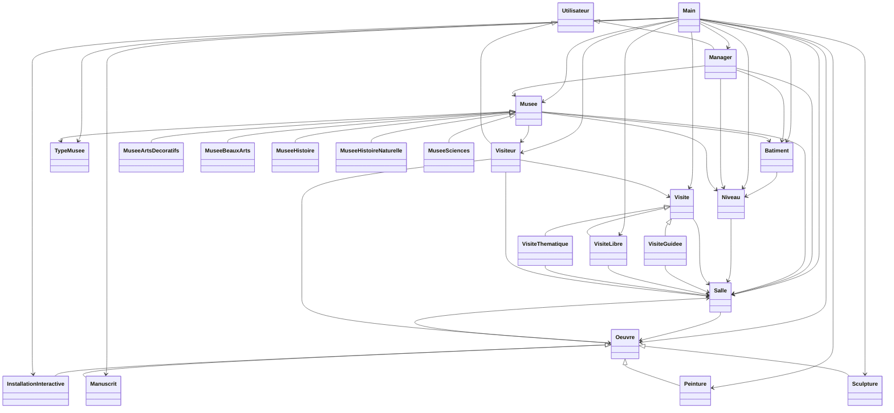

# Documentation du projet

## Vue d'ensemble

23 types : 22 classes, 0 interfaces, 1 enums, 131 méthodes.

| Type | Genre | Hérite de | Fichier |
|---|---|---|---|
| [Batiment](#batiment) | class |  | Batiment.java |
| [InstallationInteractive](#installationinteractive) | class | Oeuvre | InstallationInteractive.java |
| [Main](#main) | class |  | Main.java |
| [Manager](#manager) | class | Utilisateur | Manager.java |
| [Manuscrit](#manuscrit) | class | Oeuvre | Manuscrit.java |
| [Musee](#musee) | class |  | Musee.java |
| [MuseeArtsDecoratifs](#museeartsdecoratifs) | class | Musee | MuseeArtsDecoratifs.java |
| [MuseeBeauxArts](#museebeauxarts) | class | Musee | MuseeBeauxArts.java |
| [MuseeHistoire](#museehistoire) | class | Musee | MuseeHistoire.java |
| [MuseeHistoireNaturelle](#museehistoirenaturelle) | class | Musee | MuseeHistoireNaturelle.java |
| [MuseeSciences](#museesciences) | class | Musee | MuseeSciences.java |
| [Niveau](#niveau) | class |  | Niveau.java |
| [Oeuvre](#oeuvre) | class |  | Oeuvre.java |
| [Peinture](#peinture) | class | Oeuvre | Peinture.java |
| [Salle](#salle) | class |  | Salle.java |
| [Sculpture](#sculpture) | class | Oeuvre | Sculpture.java |
| [TypeMusee](#typemusee) | enum |  | Musee.java |
| [Utilisateur](#utilisateur) | class |  | Utilisateur.java |
| [Visite](#visite) | class |  | Visite.java |
| [VisiteGuidee](#visiteguidee) | class | Visite | VisiteGuidee.java |
| [VisiteLibre](#visitelibre) | class | Visite | VisiteLibre.java |
| [VisiteThematique](#visitethematique) | class | Visite | VisiteThematique.java |
| [Visiteur](#visiteur) | class | Utilisateur | Visiteur.java |

## Diagramme de classes

## Détail des classes

### Batiment

*class* · `Batiment.java` (lignes 4-60)

La classe Batiment représente un bâtiment d'un musée. Elle contient un identifiant unique, un nom (A, B, C, D...), une liste de niveaux contenus et un compteur du nombre de visiteurs. Elle offre des méthodes pour ajouter des niveaux, mettre à jour le nombre de visiteurs en fonction des niveaux et afficher une représentation détaillée du bâtiment, y compris les niveaux qu'il contient.

**Attributs**

- `private int id`
- `private String nom`
- `private List<Niveau> niveauxContenus`
- `private int nombreVisiteurs`

**Méthodes**

- `Batiment(int id, String nom)`
- `getId() : int`
- `getNom() : String`
- `getNiveauxContenus() : List<Niveau>`
- `getNombreVisiteurs() : int`
- `addNiveau(Niveau niveau) : void`
- `majEffectif() : void`
- `toString() : String`

### InstallationInteractive

*class* · `InstallationInteractive.java` (lignes 1-24) · hérite de **Oeuvre**

La classe InstallationInteractive est une extension de la classe Oeuvre, représentant un type spécifique d'œuvre muséale interactive. Elle possède deux attributs supplémentaires : duree et format, qui définissent respectivement la durée de l'installation et son format (par exemple, vidéo, sculpture interactive, etc.). Elle fournit des accesseurs pour ces attributs et surcharge la méthode toString() pour inclure ces informations dans la représentation textuelle de l'objet.

**Attributs**

- `private int duree`
- `private String format`

**Méthodes**

- `InstallationInteractive(String nom, String auteur, String description, String theme, int duree, String format)`
- `getDuree() : int`
- `getFormat() : String`
- `toString() : String`

### Main

*class* · `Main.java` (lignes 20-251)

La classe Main est le point d'entrée de l'application et est responsable de charger les données du fichier JSON, de créer les objets correspondants (musees, visiteurs, salles, etc.), et de démontrer le comportement des visiteurs et du manager.

**Attributs**

- `private String jsonPath`
- `private List<Musee> musees`
- `private Map<Integer, Salle> salles`
- `private List<Visiteur> visiteurs`
- `private List<Visite> visites`

**Méthodes**

- `main(String[] args) : void`
- `chargerVisiteurs(JSONArray visiteursJson) : void`
- `chargerMusees(JSONArray museesJson) : void`
- `afficherMusees() : void`

### Manager

*class* · `Manager.java` (lignes 1-31) · hérite de **Utilisateur**

La classe Manager hérite de la classe Utilisateur et est responsable de générer et afficher les statistiques d'un musée. Elle appelle la méthode `majEffectif()` sur l'objet Museum pour mettre à jour les totaux de visiteurs. Ensuite, elle itère à travers les bâtiments, niveaux et salles du musée pour afficher le nombre de visiteurs dans chaque unité. Elle affiche également le nombre de visiteurs uniques et la salle la plus fréquentée du musée.

**Méthodes**

- `Manager(int id, String nom, String prenom, String paysOrigine, String genre)`
- `obtenirStatistique(Musee musee) : void`

### Manuscrit

*class* · `Manuscrit.java` (lignes 1-24) · hérite de **Oeuvre**

La classe Manuscrit est une sous-classe de Oeuvre et représente un type spécifique d'œuvre, un manuscrit. Elle possède un attribut pour la langue du manuscrit et une pour son année de création. La classe fournit des méthodes pour obtenir ces attributs et redéfinit la méthode toString pour inclure les informations spécifiques à un manuscrit, tels que sa langue et son année.

**Attributs**

- `private String langue`
- `private int annee`

**Méthodes**

- `Manuscrit(String nom, String auteur, String description, String theme, String langue, int annee)`
- `getLangue() : String`
- `getAnnee() : int`
- `toString() : String`

### Musee

*class* · `Musee.java` (lignes 14-98)

La classe `Musee` représente un musée et contient des informations essentielles comme son nom, sa localisation (ville et pays), son type (type de musée), ainsi que des listes de bâtiments et de visiteurs uniques. Elle offre des méthodes pour ajouter des bâtiments, mettre à jour l'effectif des bâtiments, enregistrer des visiteurs, et récupérer des informations sur les visiteurs uniques et les salles les plus fréquentées. La classe implémente également la méthode `toString()` pour fournir une représentation sous forme de chaîne de caractères.

**Attributs**

- `private String nom`
- `private String ville`
- `private String pays`
- `private TypeMusee type`
- `private List<Batiment> batimentsContenus`
- `private Set<Visiteur> visiteursUniques`

**Méthodes**

- `Musee(String nom, String ville, String pays, TypeMusee type)`
- `getNom() : String`
- `getVille() : String`
- `getPays() : String`
- `getType() : TypeMusee`
- `getBatimentsContenus() : List<Batiment>`
- `addBatiment(Batiment batiment) : void`
- `majEffectif() : void`
- `enregistrerVisiteur(Visiteur v) : void`
- `getNombreVisiteursUniques() : int`
- `getSalleLaPlusFrequentee() : Salle`
- `toString() : String`

### MuseeArtsDecoratifs

*class* · `MuseeArtsDecoratifs.java` (lignes 4-38) · hérite de **Musee**

La classe MuseeArtsDecoratifs est une extension de la classe Musee et est spécifiquement conçue pour représenter un musée des Arts Décoratifs. Elle ajoute des attributs pour stocker les styles décoratifs exposés et indiquer si le musée inclut des œuvres du design contemporain. La classe utilise également la méthode toString pour fournir une représentation détaillée de l'objet, incluant ses caractéristiques spécifiques.

**Attributs**

- `private List<String> stylesDecoratifs`
- `private boolean inclutDesignContemporain`

**Méthodes**

- `MuseeArtsDecoratifs(String nom, String ville, String pays)`
- `getStylesDecoratifs() : List<String>`
- `setStylesDecoratifs(List<String> stylesDecoratifs) : void`
- `isInclutDesignContemporain() : boolean`
- `setInclutDesignContemporain(boolean inclutDesignContemporain) : void`
- `toString() : String`

### MuseeBeauxArts

*class* · `MuseeBeauxArts.java` (lignes 4-38) · hérite de **Musee**

La classe `MuseeBeauxArts` est une extension de la classe `Musee`, spécifiquement conçue pour représenter un musée des beaux-arts. Elle contient des attributs pour stocker des listes de mouvements artistiques et de grands artistes associés à ce musée. La classe redéfinit la méthode `toString()` pour inclure ces informations supplémentaires dans sa représentation textuelle.

**Attributs**

- `private List<String> mouvementsArtistiques`
- `private List<String> artistesMajeurs`

**Méthodes**

- `MuseeBeauxArts(String nom, String ville, String pays)`
- `getMouvementsArtistiques() : List<String>`
- `setMouvementsArtistiques(List<String> mouvementsArtistiques) : void`
- `getArtistesMajeurs() : List<String>`
- `setArtistesMajeurs(List<String> artistesMajeurs) : void`
- `toString() : String`

### MuseeHistoire

*class* · `MuseeHistoire.java` (lignes 4-53) · hérite de **Musee**

La classe MuseeHistoire étend la classe Musee et est spécifiquement conçue pour représenter des musées d'histoire. Elle ajoute des attributs pour stocker des périodes historiques, un indicateur de centre sur un événement spécifique et le nom de cet événement. La méthode toString est également surchargée pour inclure ces informations supplémentaires dans la représentation du musee.

**Attributs**

- `private List<String> periodesHistoriques`
- `private boolean centreEventSpecifique`
- `private String evenementSpecifique`

**Méthodes**

- `MuseeHistoire(String nom, String ville, String pays)`
- `getPeriodesHistoriques() : List<String>`
- `setPeriodesHistoriques(List<String> periodesHistoriques) : void`
- `isCentreEventSpecifique() : boolean`
- `setCentreEventSpecifique(boolean centreEventSpecifique) : void`
- `getEvenementSpecifique() : String`
- `setEvenementSpecifique(String evenementSpecifique) : void`
- `toString() : String`

### MuseeHistoireNaturelle

*class* · `MuseeHistoireNaturelle.java` (lignes 4-38) · hérite de **Musee**

La classe MuseeHistoireNaturelle est une spécialisation de la classe Musee, dédiée aux musées d'histoire naturelle. Elle maintient une liste de collections spécifiques à cette catégorie et un booléen indiquant si le musée contient des spécimens vivants. La classe surcharge la méthode `toString()` pour fournir une représentation détaillée des collections et de l'existence de spécimens vivants, en additionnant ces informations à la représentation de base de la classe parente Musee.

**Attributs**

- `private List<String> collections`
- `private boolean contientSpecimensVivants`

**Méthodes**

- `MuseeHistoireNaturelle(String nom, String ville, String pays)`
- `getCollections() : List<String>`
- `setCollections(List<String> collections) : void`
- `isContientSpecimensVivants() : boolean`
- `setContientSpecimensVivants(boolean contientSpecimensVivants) : void`
- `toString() : String`

### MuseeSciences

*class* · `MuseeSciences.java` (lignes 4-38) · hérite de **Musee**

La classe `MuseeSciences` est une sous-classe de la classe `Musee` et représente un musée spécialisé dans les sciences. Elle ajoute des attributs pour stocker les disciplines scientifiques abordées et un indicateur pour savoir si le musée est interactif. La classe redéfinit la méthode `toString()` pour fournir une représentation détaillée de l'objet, y compris le type spécifique du musée, les disciplines scientifiques et si il est interactif.

**Attributs**

- `private List<String> disciplines`
- `private boolean interactif`

**Méthodes**

- `MuseeSciences(String nom, String ville, String pays)`
- `getDisciplines() : List<String>`
- `setDisciplines(List<String> disciplines) : void`
- `isInteractif() : boolean`
- `setInteractif(boolean interactif) : void`
- `toString() : String`

### Niveau

*class* · `Niveau.java` (lignes 4-57)

La classe Niveau représente un niveau d'un bâtiment, avec un identifiant, un nom, un nombre de visiteurs et une liste de salles. Elle permet d'ajouter des salles et de mettre à jour le nombre de visiteurs total en fonction des salles contenues. La méthode toString fournit une représentation détaillée du niveau, y compris ses salles.

**Attributs**

- `private int id`
- `private String nom`
- `private int nombreVisiteurs`
- `private List<Salle> sallesContenues`

**Méthodes**

- `Niveau(int id, String nom)`
- `getId() : int`
- `getNom() : String`
- `getNombreVisiteurs() : int`
- `getSallesContenues() : List<Salle>`
- `addSalle(Salle salle) : void`
- `majEffectif() : void`
- `toString() : String`

### Oeuvre

*class* · `Oeuvre.java` (lignes 1-42)

La classe Oeuvre représente une œuvre d'art dans un musée. Elle contient des informations sur le nom, l'auteur, la description et le thème de l'œuvre. Elle est associée à une salle où elle est exposée. La classe Oeuvre peut être étendue pour représenter différents types d'œuvres spécifiques comme les manuscrits, les peintures, les sculptures et les installations interactives.

**Attributs**

- `private String nom`
- `private String auteur`
- `private String description`
- `private String theme`
- `private Salle dansSalle`

**Méthodes**

- `Oeuvre(String nom, String auteur, String description, String theme)`
- `getNom() : String`
- `getAuteur() : String`
- `getDescription() : String`
- `getTheme() : String`
- `getDansSalle() : Salle`
- `setDansSalle(Salle dansSalle) : void`
- `toString() : String`

### Peinture

*class* · `Peinture.java` (lignes 1-23) · hérite de **Oeuvre**

La classe Peinture est une sous-classe de Oeuvre, spécifiquement conçue pour représenter les peintures dans un contexte de musée. Elle étend la fonctionnalité de la classe Oeuvre en ajoutant des attributs spécifiques à la technique et au support de la peinture. Le constructeur Peinture initialise ces attributs ainsi que les attributs hérités de la classe Oeuvre. Les méthodes getTechnique() et getSupport() permettent d'accéder aux valeurs de ces attributs, tandis que la méthode toString() surcharge la méthode de la classe mère pour fournir une représentation personnalisée de la peinture, incluant sa technique et son support.

**Attributs**

- `private String technique`
- `private String support`

**Méthodes**

- `Peinture(String nom, String auteur, String description, String theme, String technique, String support)`
- `getTechnique() : String`
- `getSupport() : String`
- `toString() : String`

### Salle

*class* · `Salle.java` (lignes 4-99)

La classe Salle représente une salle d'exposition dans un musée. Elle contient des informations comme son identifiant, son nom, sa capacité, son thème, le nombre de visiteurs actuels et les salles et œuvres associées. Elle offre des méthodes pour gérer les visiteurs (ajouter ou retirer), vérifier si la salle est pleine, et afficher son effectif. La classe utilise également des listes pour stocker les salles accessibles et les œuvres présentes.

**Attributs**

- `private int id`
- `private String nom`
- `private int nombreVisiteurs`
- `private int capacite`
- `private String theme`
- `private List<Salle> sallesAccessibles`
- `private List<Oeuvre> oeuvresContenues`

**Méthodes**

- `Salle(int id, String nom, int capacite, String theme)`
- `getId() : int`
- `getNom() : String`
- `getNombreVisiteurs() : int`
- `getCapacite() : int`
- `getSallesAccessibles() : List<Salle>`
- `getOeuvresContenues() : List<Oeuvre>`
- `getTheme() : String`
- `addSalle(Salle salle) : void`
- `addOeuvre(Oeuvre oeuvre) : void`
- `estPleine() : boolean`
- `ajouterVisiteur() : void`
- `retirerVisiteur() : void`
- `majEffectif() : void`
- `toString() : String`

### Sculpture

*class* · `Sculpture.java` (lignes 1-23) · hérite de **Oeuvre**

La classe Sculpture est une sous-classe de Oeuvre et représente une sculpture spécifique. Elle possède des attributs pour les matériaux et la hauteur de la sculpture, et hérite des attributs et méthodes de la classe parente Oeuvre. La classe fournit des getters pour accéder aux matériaux et à la hauteur de la sculpture, ainsi qu'une surcharge de la méthode toString pour fournir une représentation détaillée de la sculpture.

**Attributs**

- `private String materiaux`
- `private float hauteur`

**Méthodes**

- `Sculpture(String nom, String auteur, String description, String theme, String materiaux, float hauteur)`
- `getMateriaux() : String`
- `getHauteur() : float`
- `toString() : String`

### TypeMusee

*enum* · `Musee.java` (lignes 6-11)

La classe `TypeMusee` est un énumération (enum) qui définit les différents types de musées possibles, tels que `ART`, `HISTOIRE`, `SCIENCE` et `NATURE`. Elle est utilisée pour spécifier le type de chaque musée lors de sa création, permettant ainsi une classification et une gestion facilitées des musées selon leur domaine d'expertise.

### Utilisateur

*class* · `Utilisateur.java` (lignes 1-40)

La classe Utilisateur représente un utilisateur du système, avec des attributs pour son identifiant, nom, prénom, pays d'origine et genre. Elle offre des méthodes pour accéder à ces informations et une méthode toString pour représenter l'utilisateur de manière lisible.

**Attributs**

- `private int id`
- `private String nom`
- `private String prenom`
- `private String paysOrigine`
- `private String genre`

**Méthodes**

- `Utilisateur(int id, String nom, String prenom, String paysOrigine, String genre)`
- `getId() : int`
- `getNom() : String`
- `getPrenom() : String`
- `getPaysOrigine() : String`
- `getGenre() : String`
- `toString() : String`

### Visite

*class* · `Visite.java` (lignes 6-38)

La classe Visite est une classe abstraite qui représente une visite dans un musée. Elle possède des attributs pour la date de la visite et un historique des salles visitées. Elle inclut des méthodes pour ajouter une salle à l'historique et pour obtenir la liste des salles possibles à visiter en fonction de la salle actuelle. La classe fournit également une méthode toString pour afficher les détails de la visite, y compris la date et les salles visitées.

**Attributs**

- `protected String date`
- `protected List<Salle> historique`

**Méthodes**

- `Visite(String date)`
- `ajouterSalle(Salle s) : void`
- `SallePossible(Salle salleActuelle) : List<Salle>`
- `toString() : String`

### VisiteGuidee

*class* · `VisiteGuidee.java` (lignes 5-48) · hérite de **Visite**

La classe `VisiteGuidee` est une sous-classe de `Visite` qui représente une visite guidée dans un musée ou un site culturel. Elle contient un parcours pré-défini de salles et permet de déterminer les salles disponibles pour une visite en fonction de leur capacité et de leur disponibilité. La classe redéfinit également la méthode `toString` pour fournir une représentation détaillée de la visite guidée, incluant le parcours, le nombre de salles visitées et la progression.

**Attributs**

- `private List<Salle> parcours`
- `private int index`

**Méthodes**

- `VisiteGuidee(String date, List<Salle> parcours)`
- `SallePossible(Salle salleActuelle) : List<Salle>`
- `toString() : String`

### VisiteLibre

*class* · `VisiteLibre.java` (lignes 5-22) · hérite de **Visite**

La classe VisiteLibre est une sous-classe de Visite et est utilisée pour représenter une visite libre dans un musée. Elle permet de déterminer les salles accessibles pendant une visite libre en fonction de leur disponibilité, c'est-à-dire en excluant les salles pleines. La classe surcharge la méthode `SallePossible` pour appliquer ce filtre. De plus, elle redéfinit la méthode `toString` pour inclure le type de visite, indiquant qu'il s'agit d'une visite libre sans parcours prédéfini.

**Méthodes**

- `VisiteLibre(String date)`
- `SallePossible(Salle salleActuelle) : List<Salle>`
- `toString() : String`

### VisiteThematique

*class* · `VisiteThematique.java` (lignes 6-48) · hérite de **Visite**

La classe `VisiteThematique` est une sous-classe de `Visite` qui représente une visite thématique organisée sur un parcours spécifique de salles. Elle stocke le thème de la visite, le parcours de salles associées et l'index de progression actuel. La méthode `SallePossible` retourne la liste des salles disponibles pour la visite en fonction du parcours thématique et de la capacité des salles. La méthode `toString` fournit une représentation détaillée de la visite thématique, y compris le thème, le parcours et la progression actuelle.

**Attributs**

- `private String theme`
- `private List<Salle> parcoursThematique`
- `private int index`

**Méthodes**

- `VisiteThematique(String date, String theme, List<Salle> parcours)`
- `SallePossible(Salle salleActuelle) : List<Salle>`
- `toString() : String`

### Visiteur

*class* · `Visiteur.java` (lignes 5-99) · hérite de **Utilisateur**

La classe Visiteur représente un visiteur dans un musée. Elle permet de suivre la localisation du visiteur, de changer de salle en fonction du mode de visite, d'afficher le parcours visité et de fournir une représentation sous forme de chaîne de caractères détaillée de l'état du visiteur et de son parcours.

**Attributs**

- `private Salle salleActuelle`
- `private Visite modeDeVisite`

**Méthodes**

- `Visiteur(int id, String nom, String prenom, String paysOrigine, String genre, Visite modeDeVisite, Salle salleActuelle)`
- `getSalleActuelle() : Salle`
- `getOeuvresSalleActuelle() : List<Oeuvre>`
- `changerSalle() : void`
- `afficherParcours() : void`
- `toString() : String`
